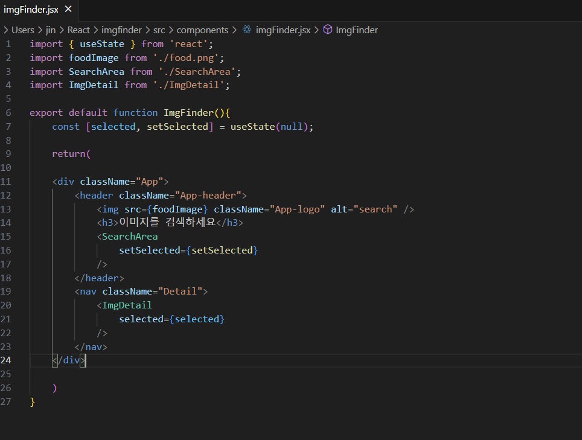

 props
 =====

> 1.  React 에서 한 컴포넌트에서 다른 컴포넌트로 데이터를 전송할 때, 사용하는 특수 객체
> 2.  Props는 단방향으로 데이터를 전송한다는 특징이 있다. 자식에서 부모로, 혹은 동일한 레벨의 컴포넌트로 Props를 전달하는 것은 불가능.
> 3.  props의 데이터 형태는 숫자, Boolean, 배열 등 다양한 형태의 데이터를 전달할 수 있는데, 문자를 제외하고는 { }로 감싸서 데이터를 전달해야한다.
> 4.  __Props의 중요한 특징 중 하나는 읽기 전용의 객체이라는 것. props를 전달 받은 자식 컴포넌트 내에서 props를 직접 수정할 수 없다.__ 
>
> 5.  부모 컴포넌트에서 값을 변경하여 자식 컴포넌트가 새로운 값을 받게 된다. 
> 6.  state는 컴포넌트의 상태를 변경하거나 업데이트할 수 있다. 
> 7.  읽기와 쓰기 모두 가능하며, setState() 함수를 사용하여 값이 변경된다. 
> 8.  props는 컴포넌트가 외부에서 받는 데이터를 의미하는 반면, state는 컴포넌트 내부에서 관리되는 데이터로 컴포넌트 자체가 가지고 있는 데이터를 의미한다. 
> 9.  React에서 props와 state는 모두 컴포넌트의 데이터를 다루는 데 사용된다. 
> 10. 일반적으로 사용자 입력 또는 네트워크 응답과 같은 이벤트에 응답하여 state를 업데이트한다.
 
 

</img>
 
> **값의 변경이 필요없는 ImgDetail 컴포넌트에 seledted를 props로 전달하고** 
> **컴포턴트 내에서 값이 변경되는 searchArea 컴포넌트에 setSelected를 props로 전달한다**
 
 
 

마크다운(Markdown) 사용법
=========================

https://gist.github.com/ihoneymon/652be052a0727ad59601

